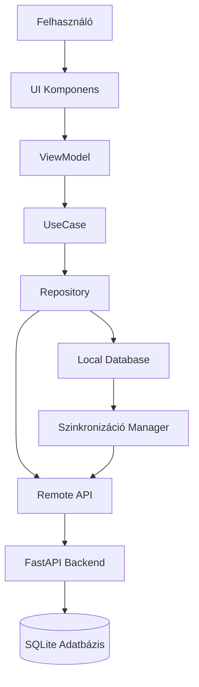

# Android Alkalmazás Implementációs Terv - CMMS Rendszer

## 1. Projekt Áttekintés

### 1.1 Cél
Teljes funkcionalitású Android mobilalkalmazás fejlesztése a meglévő CMMS (Computerized Maintenance Management System) rendszerhez, amely ugyanarra az adatbázisra kapcsolódik és minden funkciót támogat.

### 1.2 Főbb Követelmények
- **Teljes funkcionalitás**: Minden desktop funkció elérhető Android-on
- **Ugyanaz az adatbázis**: Közös SQLite adatbázis használata
- **Offline működés**: Offline cache és szinkronizáció
- **Többnyelvű támogatás**: Magyar és angol nyelv
- **Modern UI/UX**: Material Design 3 alapú felület
- **Biztonság**: JWT token alapú autentikáció

### 1.3 Meglévő Rendszer
- **Backend**: FastAPI (Python) REST API
- **Adatbázis**: SQLite (cmms.db)
- **Autentikáció**: JWT token
- **API végpontok**: `/api/auth`, `/api/users`, `/api/machines`, `/api/assets`, `/api/worksheets`
- **Többnyelvű**: hu.json, en.json fordítási fájlok

## 2. Architektúra Tervezés

### 2.1 Architektúra Minta
**MVVM (Model-View-ViewModel) + Repository Pattern + Clean Architecture**

```
┌─────────────────────────────────────────────────────────┐
│                    Presentation Layer                    │
│  ┌──────────┐  ┌──────────┐  ┌──────────┐            │
│  │ Activity │  │Fragment  │  │  View    │            │
│  └────┬─────┘  └────┬─────┘  └────┬─────┘            │
│       │             │             │                   │
│       └─────────────┴─────────────┘                   │
│                    │                                   │
│              ┌─────▼─────┐                            │
│              │ ViewModel │                            │
│              └─────┬─────┘                            │
└────────────────────┼───────────────────────────────────┘
                     │
┌────────────────────┼───────────────────────────────────┐
│              Domain Layer                              │
│  ┌──────────┐  ┌──────────┐  ┌──────────┐           │
│  │ UseCase  │  │  Entity  │  │  Mapper  │           │
│  └──────────┘  └──────────┘  └──────────┘           │
└────────────────────┼───────────────────────────────────┘
                     │
┌────────────────────┼───────────────────────────────────┐
│              Data Layer                                │
│  ┌──────────┐  ┌──────────┐  ┌──────────┐           │
│  │Repository│  │  Remote  │  │  Local   │           │
│  │          │  │   Data   │  │   Cache  │           │
│  └────┬─────┘  └────┬─────┘  └────┬─────┘           │
│       │             │             │                  │
│       └─────────────┴─────────────┘                  │
│                    │                                  │
│       ┌────────────▼────────────┐                    │
│       │   API Service (Retrofit)│                    │
│       │   Local DB (Room)       │                    │
│       └─────────────────────────┘                    │
└───────────────────────────────────────────────────────┘
```

### 2.2 Adatfolyam



## 3. Technológiai Stack

### 3.1 Alapvető Technológiák
- **Nyelv**: Kotlin 100%
- **Min SDK**: Android 8.0 (API 26)
- **Target SDK**: Android 14 (API 34)
- **Build Tool**: Gradle 8.0+
- **Kotlin Version**: 1.9.0+

### 3.2 Főbb Könyvtárak

#### UI & Navigation
- **Jetpack Compose**: Modern UI framework
- **Material Design 3**: Material You design system
- **Navigation Compose**: Fragment/Activity navigáció
- **Coil**: Képbetöltés és cache

#### Architektúra
- **ViewModel**: MVVM pattern
- **LiveData / StateFlow**: Reaktív adatfolyamok
- **Coroutines & Flow**: Aszinkron műveletek
- **Hilt**: Dependency Injection

#### Hálózat
- **Retrofit 2**: REST API hívások
- **OkHttp**: HTTP kliens
- **Gson / Moshi**: JSON serializáció
- **Chucker**: API hívások debugolása

#### Adatbázis
- **Room**: Lokális SQLite wrapper
- **Room Migrations**: Adatbázis migrációk

#### Egyéb
- **DataStore**: Preferences storage (SharedPreferences helyett)
- **WorkManager**: Háttérfeladatok (szinkronizáció)
- **Timber**: Logging
- **LeakCanary**: Memory leak detektálás

### 3.3 Projekt Struktúra

```
app/
├── src/
│   ├── main/
│   │   ├── java/com/artence/cmms/
│   │   │   ├── data/
│   │   │   │   ├── local/
│   │   │   │   │   ├── database/
│   │   │   │   │   │   ├── CMMSDatabase.kt
│   │   │   │   │   │   ├── dao/
│   │   │   │   │   │   │   ├── UserDao.kt
│   │   │   │   │   │   │   ├── MachineDao.kt
│   │   │   │   │   │   │   ├── AssetDao.kt
│   │   │   │   │   │   │   ├── WorksheetDao.kt
│   │   │   │   │   │   │   ├── InventoryDao.kt
│   │   │   │   │   │   │   └── ...
│   │   │   │   │   │   └── entities/
│   │   │   │   │   │       ├── UserEntity.kt
│   │   │   │   │   │       ├── MachineEntity.kt
│   │   │   │   │   │       └── ...
│   │   │   │   │   └── datastore/
│   │   │   │   │       └── PreferencesManager.kt
│   │   │   │   ├── remote/
│   │   │   │   │   ├── api/
│   │   │   │   │   │   ├── AuthApi.kt
│   │   │   │   │   │   ├── UserApi.kt
│   │   │   │   │   │   ├── MachineApi.kt
│   │   │   │   │   │   ├── AssetApi.kt
│   │   │   │   │   │   ├── WorksheetApi.kt
│   │   │   │   │   │   └── ...
│   │   │   │   │   ├── dto/
│   │   │   │   │   │   ├── LoginRequest.kt
│   │   │   │   │   │   ├── TokenResponse.kt
│   │   │   │   │   │   ├── UserDto.kt
│   │   │   │   │   │   └── ...
│   │   │   │   │   └── interceptor/
│   │   │   │   │       ├── AuthInterceptor.kt
│   │   │   │   │       └── ErrorInterceptor.kt
│   │   │   │   └── repository/
│   │   │   │       ├── AuthRepository.kt
│   │   │   │       ├── UserRepository.kt
│   │   │   │       ├── MachineRepository.kt
│   │   │   │       ├── AssetRepository.kt
│   │   │   │       ├── WorksheetRepository.kt
│   │   │   │       └── ...
│   │   │   ├── domain/
│   │   │   │   ├── model/
│   │   │   │   │   ├── User.kt
│   │   │   │   │   ├── Machine.kt
│   │   │   │   │   ├── Asset.kt
│   │   │   │   │   ├── Worksheet.kt
│   │   │   │   │   └── ...
│   │   │   │   ├── usecase/
│   │   │   │   │   ├── auth/
│   │   │   │   │   │   ├── LoginUseCase.kt
│   │   │   │   │   │   └── LogoutUseCase.kt
│   │   │   │   │   ├── user/
│   │   │   │   │   │   ├── GetUsersUseCase.kt
│   │   │   │   │   │   └── UpdateUserUseCase.kt
│   │   │   │   │   └── ...
│   │   │   │   └── mapper/
│   │   │   │       ├── UserMapper.kt
│   │   │   │       ├── MachineMapper.kt
│   │   │   │       └── ...
│   │   │   ├── ui/
│   │   │   │   ├── theme/
│   │   │   │   │   ├── Color.kt
│   │   │   │   │   ├── Theme.kt
│   │   │   │   │   └── Type.kt
│   │   │   │   ├── navigation/
│   │   │   │   │   └── NavGraph.kt
│   │   │   │   ├── screens/
│   │   │   │   │   ├── login/
│   │   │   │   │   │   ├── LoginScreen.kt
│   │   │   │   │   │   └── LoginViewModel.kt
│   │   │   │   │   ├── dashboard/
│   │   │   │   │   │   ├── DashboardScreen.kt
│   │   │   │   │   │   └── DashboardViewModel.kt
│   │   │   │   │   ├── inventory/
│   │   │   │   │   │   ├── InventoryScreen.kt
│   │   │   │   │   │   └── InventoryViewModel.kt
│   │   │   │   │   ├── assets/
│   │   │   │   │   │   ├── AssetsScreen.kt
│   │   │   │   │   │   └── AssetsViewModel.kt
│   │   │   │   │   ├── worksheets/
│   │   │   │   │   │   ├── WorksheetsScreen.kt
│   │   │   │   │   │   ├── WorksheetDetailScreen.kt
│   │   │   │   │   │   └── WorksheetsViewModel.kt
│   │   │   │   │   ├── pm/
│   │   │   │   │   │   ├── PMScreen.kt
│   │   │   │   │   │   └── PMViewModel.kt
│   │   │   │   │   ├── users/
│   │   │   │   │   │   ├── UsersScreen.kt
│   │   │   │   │   │   └── UsersViewModel.kt
│   │   │   │   │   ├── reports/
│   │   │   │   │   │   ├── ReportsScreen.kt
│   │   │   │   │   │   └── ReportsViewModel.kt
│   │   │   │   │   ├── settings/
│   │   │   │   │   │   ├── SettingsScreen.kt
│   │   │   │   │   │   └── SettingsViewModel.kt
│   │   │   │   │   └── ...
│   │   │   │   └── components/
│   │   │   │       ├── TopAppBar.kt
│   │   │   │       ├── BottomNavigation.kt
│   │   │   │       ├── LoadingIndicator.kt
│   │   │   │       └── ...
│   │   │   ├── di/
│   │   │   │   └── AppModule.kt
│   │   │   ├── util/
│   │   │   │   ├── Constants.kt
│   │   │   │   ├── Extensions.kt
│   │   │   │   └── ...
│   │   │   └── MainActivity.kt
│   │   └── res/
│   │       ├── values/
│   │       │   ├── strings.xml
│   │       │   ├── strings-hu.xml
│   │       │   └── strings-en.xml
│   │       └── ...
│   └── test/
└── build.gradle.kts
```

## 4. API Integráció Részletei

### 4.1 API Végpontok Mapping

#### Autentikáció
```
POST /api/auth/login
Request: { username: String, password: String }
Response: { access_token, token_type, expires_in, user_id, username, role_name }
```

#### Felhasználók
```
GET    /api/users              - Felhasználók listája
GET    /api/users/{id}         - Felhasználó részletei
POST   /api/users              - Új felhasználó
PUT    /api/users/{id}         - Felhasználó frissítése
DELETE /api/users/{id}         - Felhasználó törlése
POST   /api/users/{id}/reset-password - Jelszó reset
```

#### Gépek (Machines)
```
GET    /api/machines           - Gépek listája
GET    /api/machines/{id}      - Gép részletei
POST   /api/machines           - Új gép
PUT    /api/machines/{id}      - Gép frissítése
DELETE /api/machines/{id}      - Gép törlése
```

#### Eszközök (Assets)
```
GET    /api/assets             - Eszközök listája
GET    /api/assets/{id}        - Eszköz részletei
POST   /api/assets             - Új eszköz
PUT    /api/assets/{id}        - Eszköz frissítése
DELETE /api/assets/{id}        - Eszköz törlése
```

#### Munkalapok (Worksheets)
```
GET    /api/worksheets         - Munkalapok listája
GET    /api/worksheets/{id}    - Munkalap részletei
POST   /api/worksheets         - Új munkalap
PUT    /api/worksheets/{id}    - Munkalap frissítése
DELETE /api/worksheets/{id}    - Munkalap törlése
```

### 4.2 Retrofit API Interface Példa

```kotlin
interface AuthApi {
    @POST("/api/auth/login")
    suspend fun login(@Body request: LoginRequest): Response<TokenResponse>
}

interface UserApi {
    @GET("/api/users")
    suspend fun getUsers(): Response<List<UserDto>>
    
    @GET("/api/users/{id}")
    suspend fun getUser(@Path("id") id: Int): Response<UserDto>
    
    @POST("/api/users")
    suspend fun createUser(@Body user: UserCreateDto): Response<UserDto>
    
    @PUT("/api/users/{id}")
    suspend fun updateUser(@Path("id") id: Int, @Body user: UserUpdateDto): Response<UserDto>
    
    @DELETE("/api/users/{id}")
    suspend fun deleteUser(@Path("id") id: Int): Response<Unit>
}
```

### 4.3 JWT Token Kezelés

```kotlin
class AuthInterceptor(private val tokenManager: TokenManager) : Interceptor {
    override fun intercept(chain: Interceptor.Chain): Response {
        val request = chain.request().newBuilder()
            .addHeader("Authorization", "Bearer ${tokenManager.getToken()}")
            .build()
        return chain.proceed(request)
    }
}
```

## 5. Adatbázis Tervezés (Room)

### 5.1 Entity Példák

```kotlin
@Entity(tableName = "users")
data class UserEntity(
    @PrimaryKey val id: Int,
    val username: String,
    val email: String?,
    val fullName: String?,
    val phone: String?,
    val roleId: Int,
    val isActive: Boolean,
    val languagePreference: String,
    val createdAt: Long,
    val updatedAt: Long?
)

@Entity(tableName = "machines")
data class MachineEntity(
    @PrimaryKey val id: Int,
    val productionLineId: Int,
    val name: String,
    val serialNumber: String?,
    val model: String?,
    val manufacturer: String?,
    val status: String,
    val assetTag: String?,
    val createdAt: Long,
    val updatedAt: Long?
)

@Entity(tableName = "worksheets")
data class WorksheetEntity(
    @PrimaryKey val id: Int,
    val machineId: Int?,
    val assignedToUserId: Int?,
    val title: String,
    val description: String?,
    val status: String,
    val priority: String?,
    val createdAt: Long,
    val updatedAt: Long?
)
```

### 5.2 DAO Példák

```kotlin
@Dao
interface UserDao {
    @Query("SELECT * FROM users")
    fun getAllUsers(): Flow<List<UserEntity>>
    
    @Query("SELECT * FROM users WHERE id = :id")
    suspend fun getUserById(id: Int): UserEntity?
    
    @Insert(onConflict = OnConflictStrategy.REPLACE)
    suspend fun insertUser(user: UserEntity)
    
    @Insert(onConflict = OnConflictStrategy.REPLACE)
    suspend fun insertUsers(users: List<UserEntity>)
    
    @Update
    suspend fun updateUser(user: UserEntity)
    
    @Delete
    suspend fun deleteUser(user: UserEntity)
}
```

### 5.3 Database Osztály

```kotlin
@Database(
    entities = [
        UserEntity::class,
        MachineEntity::class,
        AssetEntity::class,
        WorksheetEntity::class,
        // ... további entitások
    ],
    version = 1,
    exportSchema = false
)
abstract class CMMSDatabase : RoomDatabase() {
    abstract fun userDao(): UserDao
    abstract fun machineDao(): MachineDao
    abstract fun assetDao(): AssetDao
    abstract fun worksheetDao(): WorksheetDao
    // ... további DAO-k
}
```

## 6. Offline Működés és Szinkronizáció

### 6.1 Szinkronizációs Stratégia

1. **Első betöltés**: API-ból letöltés és lokális tárolás
2. **Offline mód**: Lokális adatbázisból olvasás
3. **Háttérszinkronizáció**: WorkManager-rel rendszeres szinkronizáció
4. **Konfliktuskezelés**: Server-side adatok prioritása

### 6.2 WorkManager Szinkronizáció

```kotlin
class SyncWorker(
    context: Context,
    params: WorkerParameters
) : CoroutineWorker(context, params) {
    
    override suspend fun doWork(): Result {
        return try {
            // Szinkronizálás logika
            syncUsers()
            syncMachines()
            syncWorksheets()
            Result.success()
        } catch (e: Exception) {
            Result.retry()
        }
    }
}
```

## 7. UI/UX Tervezés

### 7.1 Navigation Struktúra

```
Login Screen
    ↓
Main Navigation (Bottom Navigation)
    ├── Dashboard
    ├── Inventory
    ├── Assets
    ├── Worksheets
    ├── PM (Preventive Maintenance)
    ├── Reports
    └── Settings
        ├── Profile
        ├── Language
        ├── Notifications
        └── About
```

### 7.2 Material Design 3 Komponensek

- **TopAppBar**: Minden képernyőn
- **BottomNavigation**: Fő navigáció
- **FloatingActionButton**: Új elem létrehozása
- **Cards**: Lista elemek
- **Dialogs**: Megerősítések, formok
- **Snackbars**: Értesítések

### 7.3 Többnyelvű Támogatás

```kotlin
// strings.xml (alapértelmezett - angol)
<resources>
    <string name="app_name">CMMS</string>
    <string name="login">Login</string>
    <string name="dashboard">Dashboard</string>
    ...
</resources>

// values-hu/strings.xml (magyar)
<resources>
    <string name="app_name">CMMS</string>
    <string name="login">Bejelentkezés</string>
    <string name="dashboard">Vezérlőpult</string>
    ...
</resources>
```

## 8. Funkciók Részletes Leírása

### 8.1 Bejelentkezés (Login)

**Funkciók:**
- Felhasználónév/jelszó bejelentkezés
- JWT token tárolás
- Automatikus bejelentkezés (remember me)
- Jelszó megjelenítés/elrejtés toggle
- Hibaüzenetek megjelenítése

**Implementáció:**
1. LoginScreen Compose UI
2. LoginViewModel (state management)
3. AuthRepository (API hívás)
4. TokenManager (token tárolás DataStore-ban)
5. Navigáció Dashboard-ra sikeres bejelentkezés után

### 8.2 Vezérlőpult (Dashboard)

**Funkciók:**
- Statisztikák megjelenítése:
  - Aktív munkalapok száma
  - Következő PM feladatok
  - Alacsony készletű alkatrészek
  - Karbantartási költségek
- Gyors műveletek
- Grafikonok (ha elérhető)

**Implementáció:**
1. DashboardScreen Compose UI
2. DashboardViewModel
3. Statisztikák lekérése API-ból
4. Card komponensek statisztikákhoz

### 8.3 Készletkezelés (Inventory)

**Funkciók:**
- Alkatrészek listázása
- Keresés és szűrés
- Készlet mennyiség megjelenítése
- Alacsony készlet figyelmeztetés
- Új alkatrész hozzáadása
- Alkatrész szerkesztése/törlése
- Készletmozgások (bevételezés, kiadás)

**Implementáció:**
1. InventoryScreen (lista nézet)
2. InventoryDetailScreen (részletek)
3. InventoryViewModel
4. InventoryRepository
5. CRUD műveletek

### 8.4 Eszközkezelés (Assets)

**Funkciók:**
- Production Lines listázása
- Gépek listázása (szűrhető production line szerint)
- Gép részletei:
  - Alapadatok
  - Modulok
  - Karbantartási előzmények
  - Dokumentumok (PDF manuálok)
- Új gép/modul hozzáadása
- Gép szerkesztése
- QR kód generálás/olvasás

**Implementáció:**
1. AssetsScreen (hierarchikus lista)
2. AssetDetailScreen
3. AssetsViewModel
4. AssetsRepository
5. QR kód kezelés (ZXing library)

### 8.5 Munkalapok (Worksheets)

**Funkciók:**
- Munkalapok listázása (nyitott/lezárt)
- Munkalap részletei:
  - Alapadatok
  - Hozzárendelt felhasználó
  - Alk részek használata
  - Állásidő rögzítése
  - Megjegyzések
  - Fényképek
- Új munkalap létrehozása
- Munkalap szerkesztése
- Munkalap lezárása
- PDF generálás/letöltés

**Implementáció:**
1. WorksheetsScreen (lista)
2. WorksheetDetailScreen
3. WorksheetCreateScreen
4. WorksheetsViewModel
5. WorksheetsRepository
6. PDF megjelenítés (AndroidPdfViewer library)

### 8.6 Megelőző Karbantartás (PM)

**Funkciók:**
- PM feladatok listázása
- PM ütemezés megtekintése
- PM feladat részletei
- PM feladat teljesítése
- PM előzmények
- PM sablonok kezelése

**Implementáció:**
1. PMScreen
2. PMTaskDetailScreen
3. PMViewModel
4. PMRepository

### 8.7 Felhasználókezelés (User Management)

**Funkciók:**
- Felhasználók listázása
- Felhasználó részletei
- Új felhasználó létrehozása
- Felhasználó szerkesztése
- Jogosultságok kezelése
- Felhasználó törlése

**Implementáció:**
1. UsersScreen
2. UserDetailScreen
3. UsersViewModel
4. UsersRepository

### 8.8 Jelentések (Reports)

**Funkciók:**
- Jelentések listázása
- Jelentés generálás
- PDF letöltés
- Excel export (ha elérhető)

**Implementáció:**
1. ReportsScreen
2. ReportsViewModel
3. ReportsRepository
4. PDF/Excel megnyitás

### 8.9 Beállítások (Settings)

**Funkciók:**
- Profil szerkesztése
- Nyelv váltás (hu/en)
- Értesítések beállítása
- Szinkronizáció beállítása
- Kijelentkezés
- Alkalmazás információ

**Implementáció:**
1. SettingsScreen
2. SettingsViewModel
3. PreferencesManager (DataStore)

### 8.10 További Funkciók

- **Szabadságkezelés (Vacation)**: Szabadság kérések, jóváhagyás
- **Műszakbeosztás (Shift Schedule)**: Műszakok kezelése
- **Szerviznyilvántartás (Service Records)**: Szerviz előzmények
- **Dokumentáció**: Rendszer dokumentáció megtekintése
- **Naplók (Logs)**: Audit logok megtekintése

## 9. Lépésről Lépésre Implementáció

### Fázis 1: Projekt Alapok (1-2 nap)

1. **Android Studio projekt létrehozása**
   - Új projekt: "CMMS Mobile"
   - Package name: `com.artence.cmms`
   - Minimum SDK: API 26
   - Language: Kotlin
   - UI: Jetpack Compose

2. **Gradle konfiguráció**
   - Dependencies hozzáadása (lásd: 3.2 Főbb Könyvtárak)
   - ProGuard rules
   - Build variants (debug/release)

3. **Alapvető projekt struktúra**
   - Package struktúra létrehozása (data, domain, ui)
   - Alapvető utility osztályok
   - Constants.kt

4. **Theme és Design System**
   - Material Design 3 theme
   - Színek, tipográfia
   - Komponensek (Button, Card, TextField, stb.)

### Fázis 2: Dependency Injection és Alapvető Infrastruktúra (1 nap)

1. **Hilt beállítása**
   - Application osztály (@HiltAndroidApp)
   - AppModule (@Module, @InstallIn)
   - NetworkModule (Retrofit, OkHttp)
   - DatabaseModule (Room)
   - RepositoryModule

2. **API Service Setup**
   - Retrofit instance
   - Base URL konfiguráció
   - AuthInterceptor
   - ErrorInterceptor
   - API interface-ek definiálása

3. **Database Setup**
   - Room database
   - Entity osztályok
   - DAO interface-ek
   - Database migrációk

4. **DataStore Setup**
   - Preferences DataStore
   - TokenManager
   - SettingsManager

### Fázis 3: Autentikáció (2 nap)

1. **Login Screen**
   - UI komponensek (TextField, Button)
   - State management (ViewModel)
   - Validáció
   - Loading states

2. **Auth Repository**
   - Login API hívás
   - Token tárolás
   - Token refresh logika

3. **Token Manager**
   - Token mentés DataStore-ban
   - Token lekérés
   - Token törlés

4. **Navigation Setup**
   - NavGraph
   - Login → Dashboard navigáció
   - Auth guard (ha nincs token, login screen)

### Fázis 4: Fő Navigáció és Dashboard (2 nap)

1. **Main Activity**
   - Bottom Navigation
   - Top App Bar
   - Navigation graph

2. **Dashboard Screen**
   - UI layout
   - Statisztikák kártyák
   - ViewModel
   - API integráció

3. **Repository Pattern**
   - Base repository
   - User repository példa
   - Offline cache logika

### Fázis 5: Felhasználókezelés (2 nap)

1. **Users Screen**
   - Felhasználók lista
   - Keresés/szűrés
   - Pull-to-refresh

2. **User Detail Screen**
   - Felhasználó részletei
   - Szerkesztés form
   - Törlés funkció

3. **User Repository**
   - CRUD műveletek
   - Offline cache
   - Szinkronizáció

### Fázis 6: Eszközkezelés (3 nap)

1. **Assets Screen**
   - Production Lines lista
   - Gépek lista (hierarchikus)
   - Keresés

2. **Asset Detail Screen**
   - Gép részletei
   - Modulok lista
   - Karbantartási előzmények
   - Dokumentumok

3. **QR Kód Funkciók**
   - QR kód generálás
   - QR kód olvasás (kamera)
   - QR kód alapú navigáció

4. **Assets Repository**
   - CRUD műveletek
   - Offline cache

### Fázis 7: Készletkezelés (2 nap)

1. **Inventory Screen**
   - Alk részek lista
   - Keresés/szűrés
   - Alacsony készlet figyelmeztetés

2. **Inventory Detail Screen**
   - Alk rész részletei
   - Készletmozgások
   - Szerkesztés

3. **Inventory Repository**
   - CRUD műveletek
   - Stock transactions

### Fázis 8: Munkalapok (3 nap)

1. **Worksheets Screen**
   - Munkalapok lista
   - Szűrés (nyitott/lezárt)
   - Keresés

2. **Worksheet Detail Screen**
   - Munkalap részletei
   - Alk részek hozzáadása
   - Állásidő rögzítése
   - Megjegyzések
   - Fényképek

3. **Worksheet Create Screen**
   - Új munkalap form
   - Validáció

4. **PDF Funkciók**
   - PDF generálás API-ból
   - PDF megjelenítés
   - PDF letöltés

5. **Worksheets Repository**
   - CRUD műveletek
   - Offline cache

### Fázis 9: Megelőző Karbantartás (2 nap)

1. **PM Screen**
   - PM feladatok lista
   - Ütemezés nézet
   - Szűrés

2. **PM Task Detail Screen**
   - PM feladat részletei
   - Teljesítés
   - Előzmények

3. **PM Repository**
   - CRUD műveletek

### Fázis 10: Jelentések (1 nap)

1. **Reports Screen**
   - Jelentések lista
   - Jelentés típusok

2. **Report Generation**
   - API hívás jelentés generáláshoz
   - PDF letöltés
   - Megosztás

### Fázis 11: Beállítások és További Funkciók (2 nap)

1. **Settings Screen**
   - Profil szerkesztés
   - Nyelv váltás
   - Értesítések
   - Kijelentkezés

2. **Többnyelvű Támogatás**
   - Fordítási fájlok (hu, en)
   - Nyelv váltás logika
   - Dinamikus nyelvváltás

3. **További Funkciók**
   - Vacation Screen
   - Shift Schedule Screen
   - Service Records Screen
   - Documentation Screen
   - Logs Screen

### Fázis 12: Offline Működés és Szinkronizáció (2 nap)

1. **Offline Cache**
   - Room adatbázis optimalizálás
   - Cache stratégia
   - Offline flag kezelés

2. **Szinkronizáció**
   - WorkManager setup
   - Szinkronizációs logika
   - Konfliktuskezelés
   - Szinkronizációs státusz

3. **Hálózati Állapot**
   - ConnectivityManager
   - Offline/Online indikátor
   - Automatikus szinkronizáció online állapotban

### Fázis 13: Optimalizálás és Finomhangolás (2 nap)

1. **Performance**
   - Lazy loading
   - Pagination
   - Image caching
   - Database optimalizálás

2. **UX Fejlesztések**
   - Loading states
   - Error handling
   - Empty states
   - Pull-to-refresh
   - Swipe-to-delete

3. **Biztonság**
   - Token biztonságos tárolása
   - SSL pinning (opcionális)
   - ProGuard rules

### Fázis 14: Tesztelés (2-3 nap)

1. **Unit tesztek**
   - ViewModel tesztek
   - Repository tesztek
   - UseCase tesztek

2. **UI tesztek**
   - Compose UI tesztek
   - Navigation tesztek

3. **Integrációs tesztek**
   - API integráció tesztek
   - Database tesztek

4. **Manuális tesztelés**
   - Funkciók tesztelése
   - Edge case-ek
   - Különböző eszközökön

### Fázis 15: Deployment Előkészítés (1 nap)

1. **Release Build**
   - Signing config
   - ProGuard optimalizálás
   - Version code/name

2. **Dokumentáció**
   - README
   - API dokumentáció
   - Felhasználói útmutató

3. **Play Store Előkészítés**
   - App ikon
   - Screenshot-ok
   - Leírás
   - Privacy policy

## 10. API Endpoint Mapping Táblázat

| Funkció | HTTP Method | Endpoint | Request Body | Response |
|---------|-------------|----------|--------------|----------|
| Bejelentkezés | POST | `/api/auth/login` | `{username, password}` | `{access_token, user_id, ...}` |
| Felhasználók listája | GET | `/api/users` | - | `List<UserDto>` |
| Felhasználó részletei | GET | `/api/users/{id}` | - | `UserDto` |
| Új felhasználó | POST | `/api/users` | `UserCreateDto` | `UserDto` |
| Felhasználó frissítése | PUT | `/api/users/{id}` | `UserUpdateDto` | `UserDto` |
| Felhasználó törlése | DELETE | `/api/users/{id}` | - | - |
| Gépek listája | GET | `/api/machines` | - | `List<MachineDto>` |
| Gép részletei | GET | `/api/machines/{id}` | - | `MachineDto` |
| Új gép | POST | `/api/machines` | `MachineCreateDto` | `MachineDto` |
| Gép frissítése | PUT | `/api/machines/{id}` | `MachineUpdateDto` | `MachineDto` |
| Gép törlése | DELETE | `/api/machines/{id}` | - | - |
| Eszközök listája | GET | `/api/assets` | - | `List<AssetDto>` |
| Munkalapok listája | GET | `/api/worksheets` | - | `List<WorksheetDto>` |
| Új munkalap | POST | `/api/worksheets` | `WorksheetCreateDto` | `WorksheetDto` |
| Munkalap frissítése | PUT | `/api/worksheets/{id}` | `WorksheetUpdateDto` | `WorksheetDto` |

## 11. Adatmodell Mapping

### Backend (Python/SQLAlchemy) → Android (Kotlin/Room)

| Backend Model | Android Entity | Android Domain Model |
|---------------|----------------|---------------------|
| `User` | `UserEntity` | `User` |
| `Role` | `RoleEntity` | `Role` |
| `Machine` | `MachineEntity` | `Machine` |
| `ProductionLine` | `ProductionLineEntity` | `ProductionLine` |
| `Module` | `ModuleEntity` | `Module` |
| `Part` | `PartEntity` | `Part` |
| `Worksheet` | `WorksheetEntity` | `Worksheet` |
| `PMTask` | `PMTaskEntity` | `PMTask` |
| `PMHistory` | `PMHistoryEntity` | `PMHistory` |
| `ServiceRecord` | `ServiceRecordEntity` | `ServiceRecord` |
| `StockTransaction` | `StockTransactionEntity` | `StockTransaction` |

## 12. Többnyelvű Implementáció

### 12.1 Fordítási Fájlok Struktúrája

A meglévő `hu.json` és `en.json` fájlokból generálni kell az Android `strings.xml` fájlokat.

**Példa mapping:**
```json
// hu.json
{
  "common": {
    "buttons": {
      "save": "Mentés",
      "cancel": "Mégse"
    }
  }
}
```

```xml
<!-- values-hu/strings.xml -->
<resources>
    <string name="button_save">Mentés</string>
    <string name="button_cancel">Mégse</string>
</resources>
```

### 12.2 Dinamikus Nyelvváltás

```kotlin
class LocaleHelper {
    fun setLocale(context: Context, language: String): Context {
        val locale = Locale(language)
        Locale.setDefault(locale)
        val config = Configuration(context.resources.configuration)
        config.setLocale(locale)
        return context.createConfigurationContext(config)
    }
}
```

## 13. Biztonsági Megfontolások

1. **Token Tárolás**
   - DataStore (encrypted) használata
   - Token refresh mechanizmus
   - Automatikus kijelentkezés lejáratkor

2. **Hálózati Biztonság**
   - HTTPS kötelező
   - Certificate pinning (opcionális)
   - Request/Response titkosítás (ha szükséges)

3. **Adatvédelem**
   - Lokális adatbázis titkosítása (SQLCipher opcionális)
   - Bizalmas adatok nem tárolása plain text-ben

## 14. Tesztelési Stratégia

### 14.1 Unit Tesztek
- ViewModel logika
- Repository műveletek
- UseCase implementációk
- Mapper osztályok

### 14.2 UI Tesztek
- Compose UI komponensek
- Navigation flow
- User interaction

### 14.3 Integrációs Tesztek
- API kommunikáció
- Database műveletek
- Offline/Online szinkronizáció

### 14.4 E2E Tesztek
- Teljes user flow-ok
- Kritikus funkciók (login, CRUD műveletek)

## 15. Deployment és Distribution

### 15.1 Build Konfiguráció

**build.gradle.kts (app level):**
```kotlin
android {
    compileSdk = 34
    
    defaultConfig {
        applicationId = "com.artence.cmms"
        minSdk = 26
        targetSdk = 34
        versionCode = 1
        versionName = "1.0.0"
    }
    
    buildTypes {
        release {
            isMinifyEnabled = true
            proguardFiles(
                getDefaultProguardFile("proguard-android-optimize.txt"),
                "proguard-rules.pro"
            )
        }
    }
}
```

### 15.2 Play Store Előkészítés

1. **App Ikon**: 512x512 PNG
2. **Screenshot-ok**: Legalább 2, ajánlott 4-8
3. **Leírás**: Magyar és angol nyelven
4. **Kategória**: Business/Productivity
5. **Content Rating**: Minden korosztály
6. **Privacy Policy**: Kötelező

## 16. Következő Lépések és Javaslatok

### 16.1 Rövid Távú (MVP)
1. Alapvető CRUD műveletek
2. Bejelentkezés
3. Fő funkciók (Dashboard, Assets, Worksheets, Inventory)
4. Offline alapvető működés

### 16.2 Közép Távú
1. Teljes funkcionalitás
2. Offline szinkronizáció
3. Push notifications
4. Barcode/QR scanning fejlesztése

### 16.3 Hosszú Távú
1. Tablet optimalizáció
2. Dark mode
3. Widget-ek
4. Wear OS támogatás (opcionális)
5. Offline PDF generálás

## 17. Gyakori Kérdések és Megoldások

### 17.1 Hogyan kezeljük az offline módot?
- Room adatbázis használata lokális cache-ként
- WorkManager háttérszinkronizációval
- Online/offline állapot detektálása

### 17.2 Hogyan kezeljük a token lejáratot?
- Token refresh mechanizmus
- Interceptor-ben token refresh logika
- Automatikus újrabejelentkezés szükség esetén

### 17.3 Hogyan kezeljük a nagy adatmennyiséget?
- Pagination API-ban és UI-ban
- Lazy loading
- Image compression
- Database optimalizálás

## 18. Hasznos Források és Dokumentáció

- [Jetpack Compose Dokumentáció](https://developer.android.com/jetpack/compose)
- [Material Design 3](https://m3.material.io/)
- [Retrofit Dokumentáció](https://square.github.io/retrofit/)
- [Room Persistence Library](https://developer.android.com/training/data-storage/room)
- [Hilt Dependency Injection](https://developer.android.com/training/dependency-injection/hilt-android)
- [WorkManager](https://developer.android.com/topic/libraries/architecture/workmanager)

## 19. Összefoglalás

Ez a terv részletes útmutatót ad az Android alkalmazás fejlesztéséhez. A lépések követésével egy teljes funkcionalitású, modern Android alkalmazás hozható létre, amely teljes mértékben integrálódik a meglévő CMMS rendszerrel.

**Kulcsfontosságú pontok:**
- MVVM + Clean Architecture
- Jetpack Compose modern UI-hoz
- Room offline cache-hez
- Retrofit API kommunikációhoz
- Hilt dependency injection-hez
- Többnyelvű támogatás
- Offline működés és szinkronizáció

**Becsült fejlesztési idő:** 4-6 hét (egy fejlesztővel)

**Prioritások:**
1. Alapvető infrastruktúra (DI, API, Database)
2. Autentikáció és navigáció
3. Fő funkciók (CRUD műveletek)
4. Offline működés
5. Optimalizálás és finomhangolás

---

**Megjegyzés Android Studio AI-hoz:**

Ez a dokumentum tartalmazza az összes szükséges információt az Android alkalmazás fejlesztéséhez. Használd ezt a dokumentumot referencia-ként, amikor kódot generálsz vagy implementációt készítesz. Minden funkció részletesen le van írva, és a technológiai stack is meghatározott. Kövesd a lépésről lépésre implementációt, és használd a megadott kódpéldákat mintaként.

